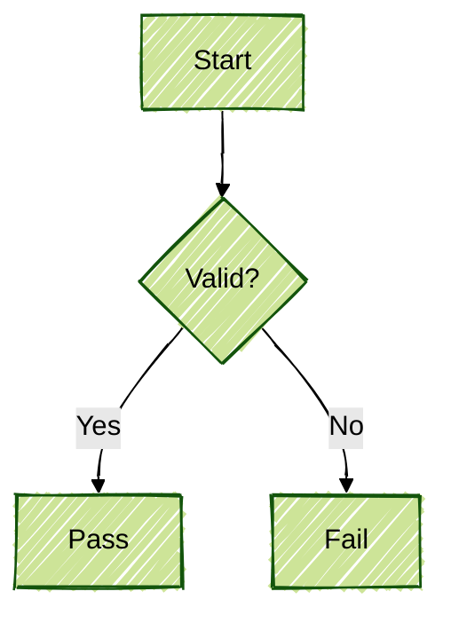

# Visual and Diagramming Standards (Mermaid)

## 1. Automated Visualization (AID)
Use AI Distiller (AID) for large codebases (50+ files) or legacy onboarding:
```bash
aid <path> --ai-action prompt-for-diagrams
```

## 2. Diagram Type Selection
| Type | Use For | Trigger |
|------|---------|---------|
| **C4 Diagrams** | System context, containers, components. | `diagram architecture` |
| **Sequence** | API flows, auth, component interactions. | `show the flow` |
| **Flowcharts** | Algorithms, decision trees, user journeys. | `visualize logic` |
| **ERD** | Database schemas, table relationships. | `map database` |
| **Class** | Domain modeling, entity relationships. | `model objects` |

## 3. The "Iron Laws" of Diagramming
1. **Readable**: Never exceed 15 nodes in a single diagram. Split if complex.
2. **Labeled**: Never leave arrows unlabeled; explain the data flow or relationship.
3. **Contextual**: Every diagram must have a title or caption.
4. **Paired**: Always pair diagrams with prose explaining the "why".
5. **Fresh**: Update diagrams when architecture changes; stale diagrams are dangerous.

## 4. Syntax Quick Reference


## 5. Flowchart Visualization (Logic)
When visualizing logic flow from source code:
- **Scope**: Focus on a single function or critical path.
- **Simplify**: Truncate repetitive loops or trivial error checks to maintain readability.
- **Symbolic**: Use standard shapes (Rectangles for actions, Diamonds for decisions).
