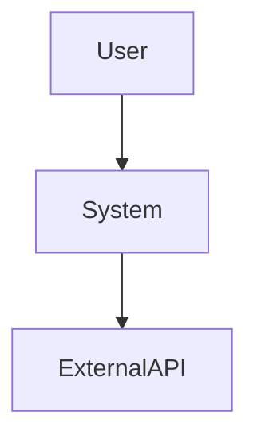

# Design Enhancements (v5.6)

Proven techniques sourced from 17 external skills across SkillsMP, SkillHub, ClawHub, skills.sh, and GitHub curations. Each enhancement fills a verified gap in the design workflow.

---

## 1. Quality Attribute Scenarios (ATAM)

**Stage**: Stage 1.7 (Pre-ADR Decision Analysis) — after precedent analysis, before ADR drafting
**Source**: ATAM (Architecture Tradeoff Analysis Method) — skillsmp_architecture-decisions

Before drafting the ADR, identify the top 3-5 quality attributes and write a scenario for each:

```
Quality Attribute: [performance | security | availability | modifiability | usability]
Scenario:
  Stimulus: [what triggers the response]
  Source: [internal/external actor]
  Environment: [normal load / peak / degraded]
  Response: [what the system does]
  Response Measure: [quantified target: latency < 200ms, uptime > 99.9%]
```

Example:
```
Quality Attribute: Availability
Scenario:
  Stimulus: Database connection pool exhausted
  Source: Internal service
  Environment: Peak traffic
  Response: Degrade to cached reads, queue writes
  Response Measure: Service remains responsive within 500ms for reads; writes queue and complete within 30s
```

Use these scenarios as evaluation criteria when comparing alternatives in the Weighted Decision Matrix.

---

## 2. Weighted Decision Matrix

**Stage**: Stage 1.7 (Pre-ADR Decision Analysis)
**Source**: skillsmp_architecture-decision + clawhub_decision-frameworks

Before drafting the ADR, score each alternative against weighted criteria:

```
Decision Matrix for: [decision title]

| Criterion (weight)      | Option A | Option B | Option C |
|--------------------------|----------|----------|----------|
| Reliability (0.30)       | 8 (2.4)  | 6 (1.8)  | 9 (2.7)  |
| Simplicity (0.25)        | 7 (1.75) | 9 (2.25) | 5 (1.25) |
| Performance (0.20)       | 6 (1.2)  | 7 (1.4)  | 8 (1.6)  |
| Flexibility (0.15)       | 5 (0.75) | 8 (1.2)  | 6 (0.9)  |
| Team Fit (0.10)          | 8 (0.8)  | 7 (0.7)  | 4 (0.4)  |
| **Weighted Total**       | **6.90** | **7.35** | **6.85** |
```

Rules:
- Criteria weights MUST sum to 1.0
- Scores are 1-10 with justification
- If top 2 options are within 0.5 points, flag as `FRAGILE-RANK` (see Decision Sensitivity Analysis)
- Document rejection reason for each eliminated option

---

## 3. C4 Model Diagramming

**Stage**: ADR drafting — Architecture Flow section
**Source**: pact-architecture-patterns + architecture-design

Include at least one C4-level diagram in every system-mode ADR:

| Level | When to Use | Mermaid Syntax |
|-------|-------------|----------------|
| Context | Every ADR — system in its environment | `C4Context` or `flowchart TD` |
| Container | When multiple deployable units exist | `C4Container` or `flowchart TD` with labeled boxes |
| Component | When a container has internal structure worth showing | `C4Component` or nested `flowchart` |

Minimum requirement: Context-level diagram. Container-level when the design has more than one deployable unit.

ADR Architecture Flow section template:
```markdown
## Architecture Flow

### System Context


### Key Components (if applicable)
[Component descriptions with responsibilities]
```

---

## 4. Reversibility Classification

**Stage**: ADR drafting — add to every ADR
**Source**: clawhub_decision-frameworks

Classify every architectural decision as one-way or two-way door:

| Classification | Test | Approach |
|----------------|------|----------|
| **One-Way Door** (Type 1) | Reverting requires >1 sprint of rework, data migration, or customer communication | Invest in analysis, prototype, get stakeholder sign-off |
| **Two-Way Door** (Type 2) | Can revert with a config change, flag toggle, or single PR | Decide fast, ship, measure, iterate |

ADR field:
```markdown
## Decision Classification
Reversibility: [One-Way Door | Two-Way Door]
Rationale: [why this classification, what would undoing it cost]
Exit plan: [how to migrate away if needed — required for one-way doors]
```

**Pro tip**: Wrap risky choices behind interfaces/abstractions. This converts many one-way doors into two-way doors.

---

## 5. Capacity Estimation

**Stage**: Stage 1.7 (Pre-ADR Decision Analysis, system-mode only)
**Source**: clawhub_system-design

For system-mode designs, sketch capacity before choosing architecture:

```
Capacity Sketch:
  Users: [DAU estimate]
  Read/Write Ratio: [e.g., 100:1]
  QPS Peak: [requests/sec with 3-10x multiplier for peaks]
  Storage/Day: [data volume + replication multiplier]
  Data Size (1 year): [projected growth]
  Bandwidth: [for large payloads]

  Likely Bottleneck: [DB | Network | Fan-out | Storage | CPU]
```

Back-of-envelope math:
1. Requests/day → QPS peak (multiply by 3-10x for peak vs average)
2. Storage/day × 365 × replication factor
3. Identify bottleneck class: is the constraint DB, network, fan-out, or storage?

This sketch prevents over-engineering (the system may not need microservices) and under-engineering (missing the real bottleneck).

---

## 6. Anti-Pattern Checklist

**Stage**: Stage 1.9 Critic Review — add to rubric
**Source**: 6+ independent skill sources converged on these

The critic MUST explicitly check for these anti-patterns:

| Anti-Pattern | Detection Signal | Severity |
|-------------|------------------|----------|
| **God Object** | One module/class handles >3 distinct concerns | High |
| **Distributed Monolith** | Microservices that share a database or require synchronized deploys | High |
| **Premature Optimization** | Performance claim without timing evidence or fallback chain position | Medium |
| **Resume-Driven Architecture** | Technology choice justified by popularity rather than problem fit | High |
| **Golden Hammer** | Same pattern/technology applied everywhere regardless of fit | Medium |
| **Leaky Abstraction** | Internal details exposed through interface (ORM model in API response) | Medium |
| **Circular Dependencies** | Module A imports Module B which imports Module A | High |
| **Big Ball of Mud** | No clear layer boundaries, tight coupling, shared mutable state | High |
| **Sunk Cost Fallacy** | Continuing a path because of past investment, not future value | Medium |
| **Analysis Paralysis** | More than 3 alternatives evaluated without a decision matrix | Low |

For each detected anti-pattern, the critic must cite: the specific ADR section, the evidence, and the recommended alternative.

---

## 7. RICE / MoSCoW Prioritization

**Stage**: Step 0.4 (Claim Verification Gate — scoping decisions)
**Source**: clawhub_decision-frameworks

When scope is ambiguous, use RICE to prioritize features/components:

```
RICE Score = (Reach × Impact × Confidence) / Effort

Reach:  users/events affected per quarter
Impact: 3=massive, 2=high, 1=medium, 0.5=low, 0.25=minimal
Confidence: 100%=high, 80%=medium, 50%=low
Effort: person-weeks
```

Then classify scope using MoSCoW:

| Category | Budget Target | Meaning |
|----------|---------------|---------|
| **Must** | ~60% of effort | Non-negotiable for this design |
| **Should** | ~20% of effort | Important but not critical |
| **Could** | ~15% of effort | Desirable if time permits |
| **Won't** | ~5% (planning) | Explicitly out of scope |

Add to ADR: `## Scope Classification` with MoSCoW labels per component.

---

## 8. Trade-off Triangle

**Stage**: Stage 1.9 Critic Review — add to rubric
**Source**: skillsmp_architecture-decision

Every ADR decision positions on a trade-off triangle:

```
        Simplicity
           /\
          /  \
         /    \
    Performance--Flexibility
```

For each decision, state which vertex is **favored** and which is **degraded**:

```markdown
## Trade-off Position
Favored: [Simplicity | Performance | Flexibility]
Degraded: [Simplicity | Performance | Flexibility]
Rationale: [why this trade-off is acceptable for this context]
```

The critic should flag any ADR that claims to optimize all three simultaneously — that claim requires extraordinary evidence.

---

## 9. Pattern Selection by Problem Type

**Stage**: Stage 1.7 (Pre-ADR Decision Analysis)
**Source**: ratacat_design-patterns

When selecting patterns for the ADR, use this decision tree:

| Problem Shape | Pattern Candidates |
|---------------|-------------------|
| Multiple ways to do something, swap at runtime | Strategy |
| One-to-many notification dependency | Observer |
| Complex/conditional object creation | Factory, Builder |
| Add behavior without inheritance | Decorator |
| Incompatible interfaces need to work together | Adapter |
| Simplify a complex subsystem | Facade |
| Algorithm varies by internal state | State |
| Sequential processing by multiple handlers | Chain of Responsibility |
| Reduce N-to-N communication complexity | Mediator |
| Track changes for atomic commit | Unit of Work |
| Abstract data source behind collection interface | Repository |

Anti-pattern check:
- If applying the same pattern >3 times in one ADR → Golden Hammer risk
- If the pattern requires >2 new abstractions for a simple problem → over-engineering risk
- If no pattern fits cleanly → keep it simple, no pattern is better than a forced one

---

## 10. Architecture Review Checklist

**Stage**: Stage 1.9 Critic Review — structured evaluation categories
**Source**: architecture-design-review

Organize critic findings into these categories:

### Structure
- [ ] Clear separation of concerns
- [ ] Cohesive components
- [ ] Loose coupling between components
- [ ] No circular dependencies

### Scalability
- [ ] Identified bottlenecks addressed
- [ ] Stateless services where possible
- [ ] Caching strategy defined (what, TTL, invalidation)
- [ ] Database scaling approach planned

### Security
- [ ] Authentication/authorization designed
- [ ] Sensitive data protection planned
- [ ] Input validation at boundaries

### Operations
- [ ] Error handling consistent
- [ ] Logging strategy defined
- [ ] Monitoring approach planned

### Documentation
- [ ] Architecture diagrams included
- [ ] API contracts defined
- [ ] Component responsibilities documented

Each checklist item that fails MUST produce a critic finding with severity.

---

## 11. Spec Self-Review

**Stage**: After Stage 1.9b validation, before Stage 1.10 quality check
**Source**: brainstorming

Before the ADR is finalized, run a 4-point self-review:

1. **Placeholder scan**: Any TBD, TODO, incomplete sections, or vague requirements? Fix them.
2. **Internal consistency**: Do any sections contradict each other? Does the architecture match the feature descriptions?
3. **Scope check**: Is this focused enough for a single implementation plan, or does it need decomposition?
4. **Ambiguity check**: Could any requirement be interpreted two different ways? If so, pick one and make it explicit.

If any check fails, fix inline before proceeding to quality check.

---

## 12. Design Principles Quick Reference

**Stage**: Stage 1.9 Critic Review — evaluation criteria
**Source**: python-design-patterns

Use these principles as evaluation lenses during critic review:

| Principle | Violation Signal | Critic Check |
|-----------|------------------|--------------|
| **KISS** | Solution is more complex than the problem requires | Is there a simpler alternative that solves the same problem? |
| **Single Responsibility** | One module handles >1 distinct concern | Can this be split without adding complexity? |
| **Composition > Inheritance** | Deep class hierarchy to share behavior | Could composition achieve the same with less coupling? |
| **Rule of Three** | Abstraction created for <3 use cases | Is this abstraction justified by actual usage, not theoretical reuse? |
| **Dependency Injection** | Business logic creates its own dependencies | Can dependencies be injected for testability? |
| **Encapsulate What Varies** | Changes ripple through multiple modules | Is the varying part isolated behind a stable interface? |

The critic should flag violations of these principles as findings with severity based on blast radius.

---

## Implementation Notes

- All 12 enhancements are advisory guidance — they enrich the design workflow without requiring schema changes
- Stages 1-6 are HIGH priority; Stages 7-12 are MEDIUM priority
- The critic rubric (Stage 1.9) absorbs items 6, 8, 10, and 12 as expanded check categories
- Items 2 and 4 create a new decision analysis phase between precedent analysis and ADR drafting
- Item 5 adds a lightweight capacity step for system-mode queries only
