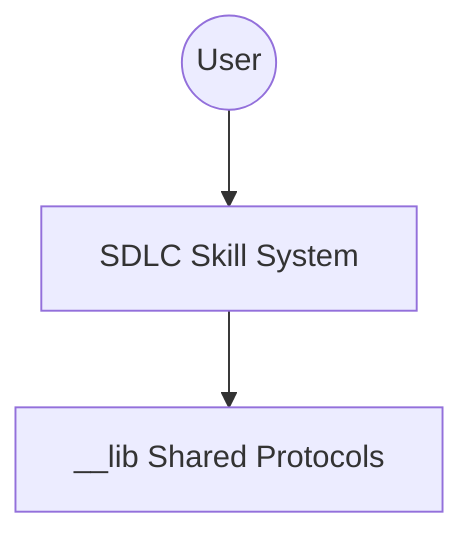

# Mermaid Diagrams (C4 & Architecture)

## Overview

Create professional software diagrams maintainable alongside code.

**Mandatory Protocol:** See `__lib/visual_standards.md` for AID Integration, Diagram Type Selection, and the "Iron Laws" of Diagramming.

## Phase Structure

### PHASE 1: Generation
Generate diagram code based on user requirements.

### PHASE 2: Validation
Review the generated diagram for correctness and readability.

---
### STOP GATE

**Between PHASE 1 and PHASE 2**: You MUST present the generated diagram to the user and wait for confirmation before proceeding to any implementation or further elaboration.

**Do NOT:**
- Auto-refine diagrams without user input
- Proceed to implementation based on unconfirmed diagrams
- Mix generation and validation in the same response block

## Automated Diagramming (AID)

```bash
# Generate 10 comprehensive diagrams for the codebase
aid <path> --ai-action prompt-for-diagrams
```

## Quick Start Example (C4 System Context)



## Best Practices

1. **Readability**: Maximum 15 nodes per diagram.
2. **Labeling**: Every arrow must explain the data flow.
3. **Synchronization**: Update diagrams when architecture changes.

See `__lib/visual_standards.md` for themes and layout configuration.

## Evidence-First Principles

### E1 — Evidence before claims
Before claiming code is absent, unchanged, or non-existent — search the codebase and verify with tools first. Claims of absence are only valid after confirmed Read/Grep/git failures.

### E4 — Investigate before asking
Do NOT answer without reading relevant source files first. Do not ask the user for information you can obtain yourself via Read, Grep, Bash, git, or available MCP tools.

### E5 — Anti-lazy escape hatch
Prohibited:
- "I assume", "I think", "probably" without tool verification
- Claiming something doesn't exist without confirmed tool failure
- Skipping evidence gathering because the answer seems obvious
