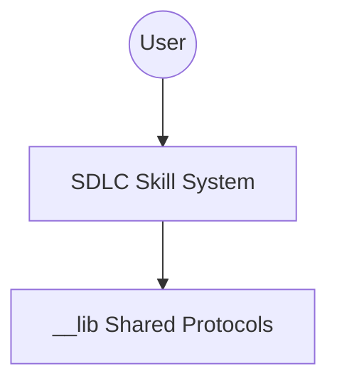

# Mermaid Diagrams (C4 & Architecture)

## Overview

Create professional software diagrams maintainable alongside code.

**Mandatory Protocol:** See `__lib/visual_standards.md` for AID Integration, Diagram Type Selection, and the "Iron Laws" of Diagramming.

## Automated Diagramming (AID)

```bash
# Generate 10 comprehensive diagrams for the codebase
aid <path> --ai-action prompt-for-diagrams
```

## Quick Start Example (C4 System Context)



## Best Practices

1. **Readability**: Maximum 15 nodes per diagram.
2. **Labeling**: Every arrow must explain the data flow.
3. **Synchronization**: Update diagrams when architecture changes.

See `__lib/visual_standards.md` for themes and layout configuration.
